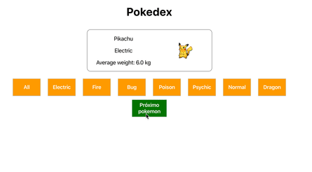

### Bloco 12, Dia 1 -> Componentes com estado e eventos

Hoje você vai incrementar a sua `Pokedex` utilizando `State`.

_**Exercício 12.1 - Parte I**_

 - Altere a sua página para que, ao invés de exibir toda a lista de pokémons, ela exiba um pokémon por vez. Ao apertar um botão de Próximo pokémon, a página passa a exibir o próximo pokémon da lista, e depois o próximo, e assim sucessivamente. Ao se chegar ao último pokémon da lista, a pokedex deve voltar para o primeiro pokémon no apertar do botão. 
     - _Dica: Lembre-se [disso][link]!_

_**Exercício 12.1 - Parte II**_

 - Sua pokedex deve ter dois botões contendo os tipos `Fire` e `Psychic`. A partir dessa seleção, a pokedex deve circular somente pelos pokémons daquele tipo. Quando a página carrega, um desses filtros deve estar selecionado.

_**Exercício 12.1 - Parte BÔNUS**_

Agora que você pegou todos os pokémons, consegue pegar todos os bônus?! Não é fácil completar todos! Faça quantos conseguir.

 - Separe os estilos de **CSS** por componente, fazendo um arquivo `.css` para cada;

 - Sua pokedex deve ter um terceiro botão chamado _All_ para resetar o filtro. Após clicá-lo, a pokedex deve voltar a circular por todos os pokémons. Quando a página carrega, o filtro selecionado deve ser o _All_;

 - Crie um componente `Button` e use-o para fazer os botões reutilizáveis da sua Pokedex;
     - _Dica: pesquise sobre o `this.props.children` do React!_

 - Faça os botões de filtragem serem **dinâmicos**: sua pokedex deve gerar um botão de filtragem para cada tipo de pokémon disponível nos dados, independente de quais ou quantos sejam, sem repetição de tipos. Ou seja, se sua pokedex possui pokémons do tipo `Fire`, `Psychic`, `Electric` e `Normal`, deve aparecer como opção de filtro um botão para cada um desses tipos. Além disso, ela deve manter o botão _All_;

 - Faça o botão de Próximo pokémon ser desabilitado se a lista filtrada de pokémons tiver um só pokémon.

Abaixo, um exemplo com todos os bônus feitos:

[link]: https://pt-br.reactjs.org/docs/state-and-lifecycle.html#state-updates-may-be-asynchronous
