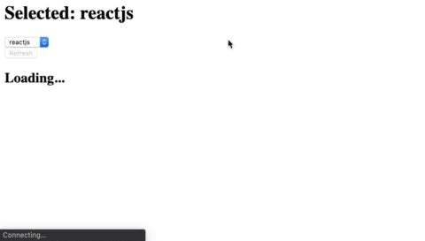

### Bloco 16, Dia 4 -> Usando o Redux no React - Actions Assíncronas

_**Exercício 16.4 - Parte I**_

Nesse exercício, utilizaremos [essa API](https://aws.random.cat/meow) para realizarmos nossas requisições. Vamos focar apenas no desenvolvimento de uma **action assíncrona** e na implementação do `thunk` na `store`. O `reducer`, assim como os componentes da aplicação, já estão prontos. Desse modo, realizaremos modificações apenas nos arquivos `actions/index.js` e `store/index.js`.

 - Nessa aplicação, temos dois componentes: 
   - `Gallery.js`, o qual renderiza uma imagem a partir de uma _URL_ armazenada no estado global da aplicação;
   - `Button.js`, o qual renderiza um botão que, ao ser clicado, faz a requisição de uma imagem e armazena a URL no estado global por meio de uma `action` assíncrona;

 - Como a aplicação está quase pronta, já temos o `reducer` e os componentes concluídos, nos falta somente a implementação do `thunk` e da action assíncrona. Para isso:
   - Caso ainda não tenha feito, execute o comando `npm install` para instalar as dependecias necessárias para a aplicação: `redux`, `react-redux`, `redux-thunk`;
   - Faça as implementações necessárias na **store** (arquivo `store/index.js`);
   - No arquivo `actions/index.js`, desenvolva a action assíncrona necessária para a aplicação rodar adequadamente. Essa _action_ assíncrona deverá fazer o uso de outras duas actions:
     - Da `requestAPI`: para informar ao usuário que a informação solicitada está carregando;
     - Da `getPicture`: para salvar no estado global da aplicação a _URL_ da imagem solicitada da API;
 
_Observação: Para essa aplicação, é necessário que o nome da action assíncrona seja **fetchAPI**._

_**Exercício 16.4 - Parte II**_

Vamos fazer uma pequena aplicação que nos permitirá buscar informações sobre os personagens da famosa série de livros **As Crônicas de Gelo e Fogo**, que gerou a famosa série **Game of Thrones**.

 - Neste repositório você encontrará alguns componentes React prontos. Além do próprio App, você terá o componente `SearchForm` - que se trata de um componente de classe que armazena o valor de `inputText` na medida que se digita algo no campo de busca e, quando se clica no botão da página, leva o texto digitado como valor de `characterSearched`;
 - Já o componente `characterInfo` exibe na tela informações obtidas através da **API** (que já está disponível para uso na pasta `services`) - tais como o nome completo, os apelidos, o gênero e os livros em que o personagem aparece. Se ficou sem entender alguma parte, estude a aplicação e coloque um `console.log()` na propriedade que estiver com dúvidas;

Então, a **API** está pronta, os componentes estão prontos, mas precisamos obter as informações da **API** e passar suas informações para a tela. Para tanto:

 - Execute o comando `npm install` e instale os pacotes `redux`, `react-redux` e `redux-thunk`. Crie o `thunk` que fará a requisição para a **API** e as `actions` referentes ao retorno com sucesso ou falha na dita requisição (não se esqueça de importar a função `charAPI.js` no seu arquivo `actions.js`);
 - Crie o `Reducer` que tratará as actions criadas no passo acima e insira-o no `combineReducers`.
   - _**Importante:** a API retorna uma array com um único objeto, logo você precisa acessar a posição correta do array para, em seguida, se utilizar do objeto;_
 - Conecte a `action` a ser despachada no seu componente `SearchForm` e os `states` oriundos do `reducer` no componente `characterInfo`, e também prepare o componente para exibir uma mensagem em caso de erro da **API**.
 - Utilize as `Props` importadas do seu `reducer` para renderizar o as informações na tela. Ao final, sua aplicação ficará mais ou menos assim:  

_**P.S.**: a nossa aplicação somente consegue fazer buscas pelo nome completo do personagem - ou seja, procurar somente por **Tyrion** não nos dará nenhum retorno, já **Tyrion Lannister** sim._

_**Exercício 16.4 - Parte BONUS**_

Como Redux exige muita prática, eis aqui mais um exercício! Desta vez, um mini-projeto para se desenvolver e guardar no portfólio!
Conhece o **Reddit**? É uma comunidade na qual pessoas conseguem criar grupos de discussão acerca de algum assunto. Tal grupo é chamado de **subreddit**. Para cada **subreddit** pessoas podem fazer postagens (_posts_). Como exercício, você vai fazer uma aplicação que permite a quem usá-la ver posts referentes a dois **subreddits**:

   > * `reactjs`
   > * `frontend`

   - Sua aplicação deve permitir a quem usá-la poder escolher de qual **subreddit** se deseja ver as postagens. No momento que selecionar o **subreddit**, uma requisição precisa ser feita no **reddit** para buscar os _posts_ referentes ao **subreddit** escolhido Para cada postagem você precisa mostrar pelo menos o título do _post_. Além disso, sua aplicação deve permitir a quem usá-la a possibilidade de atualizar a lista de postagens referentes ao **subreddit** escolhido;
   - É obrigatório que você gerencie o estado de sua aplicação com **`Redux`**, guardando os **subreddits**, assim como os posts de cada **subreddit**, no `store`. Você precisa fazer uso do `redux-thunk` para permitir criar `actions` assíncronas;

  **Pontos importantes:**
   - Para buscar os posts referentes a um **subreddit**, você pode fazer uma requisição `GET` para `https://www.reddit.com/r/<subreddit>.json`. Ou seja, se você precisar buscar _posts_ do **subreddit** `reactjs`, você faria uma chamada para `https://www.reddit.com/r/reactjs.json`;
     - No `json` retornado você encontra os dados referentes aos posts dentro da propriedade `data.children`. Para cada _post_ dentro de `data.children` você encontra seu título correspondente na propriedade `data.title`;
   - Antes de começar a sair implementando, pare e pense sobre como desenhar o estado da sua aplicação. O que você precisa guardar no estado? Como você vai estruturar e organizar seus dados? Quais `actions` você precisa ter para modelar os eventos que ocorrerão na sua aplicação (fazer uma requisição, obter sua resposta, atualizar a lista, etc...)? Como você vai organizar seus `reducers` (lembrando que NUNCA deve-se alterar o estado, e sim criar um novo )?
   - Como você está fazendo uma requisição de um recurso externo, o que acontece se a requisição de postagens referentes a um **subreddit** falhar? Adicione na sua aplicação **tratamento de erro** para esses casos, salvando no estado da sua aplicação a mensagem de erro para o **subreddit** correspondente. _Dica: procure e investigue no **Google** como fazer tratamento de erro de requisição no contexto de **`Redux`**;_
   - Como forma de ter um melhor diagnóstico sobre o fluxo de dados em uma aplicação **`Redux`** , instale o _middleware_ `redux-logger` e o integre na sua aplicação.
   - Instale a extensão do Chrome `redux-dev-tools` e a integre na sua aplicação. Com isso, você tem um ambiente completo para poder analisar e depurar sua aplicação. 🚀

 
É mostrada em sequência uma sugestão de implementação da aplicação:  

