### Bloco 24, Dia 2 -> Updates Complexos - Arrays - Parte 1

Você continuará utilizando o mesmo `dataset` de filmes do dia anterior. Se você fez todos os exercícios corretamente, apenas siga para o primeiro exercício de hoje. Caso contrário, conecte-se à sua instância e utilize o trecho de código abaixo para inserir os documentos e ficar na mesma página!

```json
{
  "title": "Batman",
  "category": [ "action", "adventure" ],
  "imdbRating": 7.6,
  "budget": 35
},
{
  "title": "Godzilla",
  "category": [ "action", "adventure", "sci-fi" ],
  "imdbRating": 6.6
},
{
  "title": "Home Alone",
  "category": [ "family", "comedy" ],
  "imdbRating": 7.4
}
```

Para cada execução, utilize o método `find()` para conferir as alterações nos documentos.
O **MongoDb** possui diversas ferramentas, como, por exemplo, `mongo`, `mongo sh`, `Compass` e outras ferramentas de terceiros. Você pode utilizar o que achar melhor para executar as _queries_, o importante é realizá-las.


_**Exercícios 24.2 - Parte I**_

 - Adicione a categoria `superhero` ao filme `Batman`; <br>
  Após a execução do método `.find().pretty()`, o resultado do filme `Batman` será parecido com o dessa imagem: <br>
  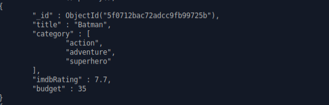 <br><br>

 - Utilizando o modificador `$each`, adicione as categorias `villain` e `comic-based` ao filme `Batman`; <br>
  Após a execução do método `.find().pretty()`, o resultado do filme `Batman` será parecido com o dessa imagem: <br>
  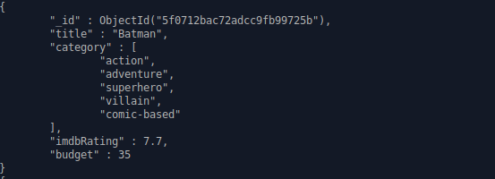 <br><br>

 - Remova a categoria `action` do filme `Batman`; <br>
  Após a execução do método `.find().pretty()`, o resultado do filme `Batman` será parecido com o dessa imagem: <br>
   <br><br>

 - Remova o **primeiro** elemento do _array_ `category` do filme `Batman`; <br>
 Após a execução do método `.find().pretty()`, o resultado do filme `Batman` será parecido com o dessa imagem: <br>
  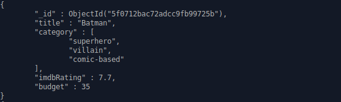 <br><br>

 - Remova o **último** elemento do _array_ `category` do filme `Batman`; <br>
 Após a execução do método `.find().pretty()`, o resultado do filme `Batman` será parecido com o dessa imagem: <br>
  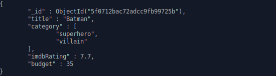 <br><br>

 - Adicione o elemento `action` ao _array_ `category` do filme `Batman`, garantindo que esse valor não se duplique; <br>
 Após a execução do método `.find().pretty()`, o resultado do filme `Batman` será parecido com o dessa imagem: <br>
  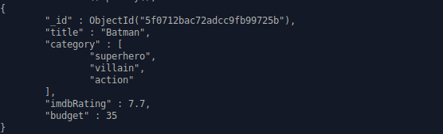 <br><br>

 - Adicione a categoria `90's` aos filmes `Batman` e `Home Alone`; <br>
  Após a execução do método `.find().pretty()`, o resultado do filme `Batman` será parecido com o dessa imagem: <br>
  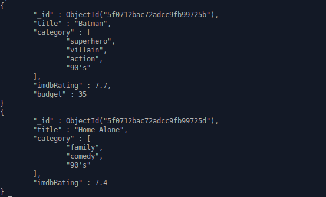 <br><br>

 - Crie um _array_ de documentos chamado `cast` para o filme `Home Alone` com os seguintes dados:
    ```JSON
    {
      "actor": "Macaulay Culkin",
      "character": "Kevin"
    },
    {
      "actor": "Joe Pesci",
      "character": "Harry"
    },
    {
      "actor": "Daniel Stern"
    }
    ```
    Após a execução do método `.find().pretty()`, o resultado do filme `Batman` será parecido com o dessa imagem: <br>
    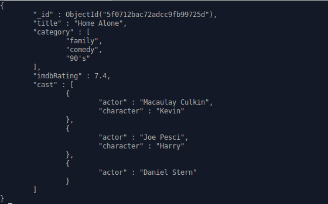 <br><br>

 - Adicione o campo `character` com o valor `Marv` ao _array_ de `cast` em que o campo `actor` seja igual a `Daniel Stern` no filme `Home Alone`; <br>
  (_Dica: Para isso, [leia aqui](https://docs.mongodb.com/manual/reference/operator/update/positional/) sobre o operador `$`_) <br>
  Após a execução do método `.find().pretty()`, o resultado do filme `Batman` será parecido com o dessa imagem: <br>
  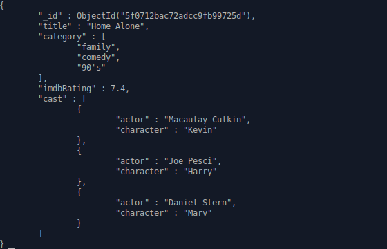 <br><br>

 - Crie um _array_ de documentos chamado `cast` para o filme `Batman` com os seguintes dados:
    ```JSON
    {
      "character": "Batman"
    },
    {
      "character": "Alfred"
    },
    {
      "character": "Coringa"
    }
    ```
    Após a execução do método `.find().pretty()`, o resultado do filme `Batman` será parecido com o dessa imagem: <br>
    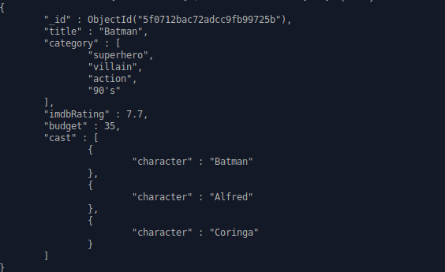 <br><br>

 - Produza três _queries_ para o filme `Batman`:
   - Adicione o campo `actor`, que deve ser um _array_ com o valor `Christian Bale`, ao _array_ de `cast` em que o campo `character` seja igual a `Batman`;
   - Adicione o campo `actor`, que deve ser um _array_ com o valor `Michael Caine`, ao _array_ de `cast` em que o campo `character` seja igual a `Alfred`;
   - Adicione o campo `actor`, que deve ser um _array_ com o valor `Heath Ledger`, ao _array_ de `cast` em que o campo `character` seja igual a `Coringa`;

    (_Dica: Para isso, [leia aqui](https://docs.mongodb.com/manual/reference/operator/update/positional/) sobre o operador `$`_) <br>
    Após a execução do método `.find().pretty()`, o resultado do filme `Batman` será parecido com o dessa imagem: <br>
    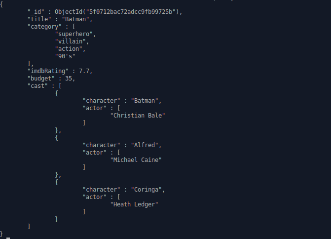 <br><br>

 - Adicione aos atores de `cast` do `character` `Batman` do filme `Batman` os valores `Michael Keaton` , `Val Kilmer` e `George Clooney`, e deixe o _array_ em ordem alfabética;
    (_Dica: Para isso, [leia aqui](https://docs.mongodb.com/manual/reference/operator/update/positional/) sobre o operador `$`_) <br>
    Após a execução do método `.find().pretty()`, o resultado do filme `Batman` será parecido com o dessa imagem: <br>
    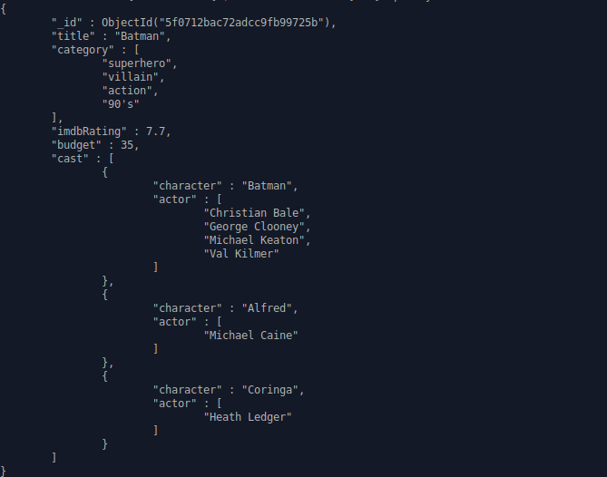 <br><br>
