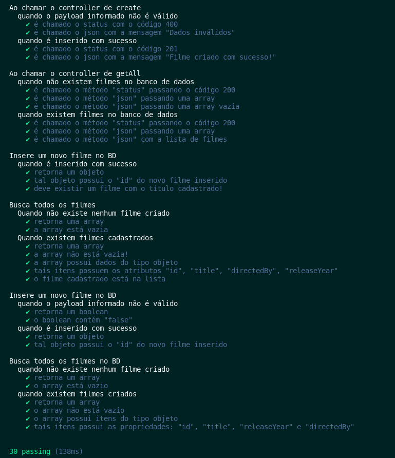

### Bloco 27, Dia 3 -> Arquitetura de Software - Testando as Camadas

Para esta atividade usaremos o seguinte repositório:
```bash
git clone git@github.com:tryber/26.4_testes_em_camadas.git
```

Realize a instalação das dependências: `npm install`;

Crie sua branch e siga as intruções seguintes. Esses exercícios serão realizados um pouco diferente: Iremos implementar novas funcionalidades no projeto visto no conteúdo e na aula ao vivo. Seguiremos a mesma metodologia, implementando os requisitos solicitados utilizando `TDD` em cada camada por vez.

O exercício possui a seguinte estrutura de arquivos e diretórios:
```bash

└── controllers
│   └── movieController.js
└── models
│   └── connection.js
│   └── movieModel.js
└── services
│   └── movieService.js
└── tests
│   ├── controllers
│   │   └── movieControllerCreate.test.js
│   │   └── movieControllerGetAll.test.js
│   └── models
│   │   └── mongoMockConnection.js
│   │   └── movieModelCreate.test.js
│   │   └── movieModelGetAll.test.js
│   ├── services
│   │   └── movieServiceCreate.test.js
│   │   └── movieServiceGetAll.test.js
└── index.js
```

Garanta que está tudo ok, rodando os testes: `npm test`;



Para subir a aplicação, é necessário ter o **`MongoDB`** rodando em sua máquina _(Relembre em 23.1 - Introdução ao MongoDB)_, feito isso é possível executá-la: `node index.js`

> Lembre-se que é possível consumir os endpoints do projeto utilizando o **Postman**.

Nos exercícios iremos implementar todas as camadas, para adicionar um _endpoint_ que recebe o `ID` de um filme específico e, então, retorna os detalhes desse filme.

Esse _endpoint_ terá os seguintes cenários:

 - Quando é encontrado um filme com o `ID` passado pela pessoa usuária deverá retornar um objeto com todas as propriedades do filme e o código _http_ `200 - OK` no `status` da `response`;
 - Quando não é encontrado nenhum filme com o `ID` passado pela pessoa usuária deverá responder com código _http_ `404 - Not Found` no `status` da `response` e com a mensagem `"Filme não encontrado."`;


_**Exercícios 27.3 - Parte I**_

Seguindo o `TDD`, implemente a camada de `model` necessária para o _endpoint_, aplicando os comportamentos para atender aos requisitos:

 - Crie os testes da camada de `model`. Como essa camada é responsável por realizar as operações no `BD`, adicione as operações necessárias para que o _endpoint_ funcione conforme esperado;

 - Implemente os métodos para atender aos cenários descritos nos testes;

 - Faça os ajustes necessários nos testes de acordo com sua implementação. Lembre-se de isolar qualquer operação de leitura e escrita;


_**Exercícios 27.3 - Parte II**_

Também seguindo o `TDD`, implemente a camada de `service` do _endpoint_, certifique-se de garantir que os cenários descritos nos requisitos serão atendidos.

 - Crie os testes da camada de `service`. Lembre-se que essa camada é responsável pelas **regras de negócio**, e deverá fazer os tratamentos necessários com o `input` recebido do `controller` e com o `output` recebido do `model`;

 - Implemente os métodos necessários para atender aos testes;

 - Faça os ajustes necessários nos testes de acordo com sua implementação. Lembre-se de isolar a camada das demais;


_**Exercícios 27.3 - Parte III**_

Também seguindo o `TDD`, implemente a camada de `controller` do _endpoint_, certifique-se de garantir que os cenários descritos nos requisitos serão atendidos.

 - Crie os testes da camada de `controller`. Lembre-se que essa camada é responsável por toda a comunicação com a pessoa usuária, devendo tratar seu `input` e `output`. Outro ponto de atenção é que diferente das outras camadas, os `controllers` são `middlewares` e será necessário criar asserções com os `stubs` para testar seus comportamentos;

 - Implemente o código necessário para atender os cenários descritos nos testes;

 - Faça os ajustes necessários nos testes de acordo com sua implementação. Lembre-se de isolar a camada das demais;


_**Exercícios 27.2 - Parte IV**_

Faça os ajustes no `index.js` para finalizar o _endpoint_;
