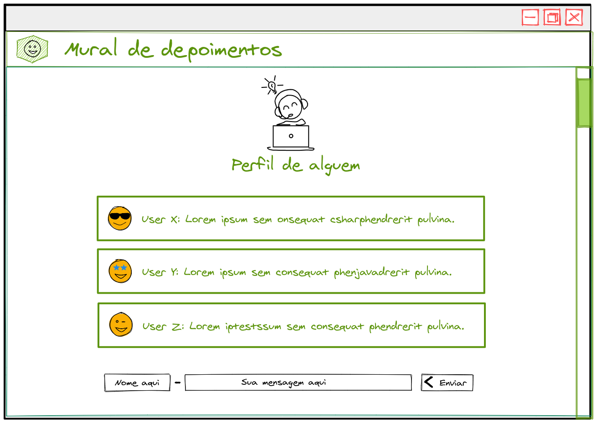
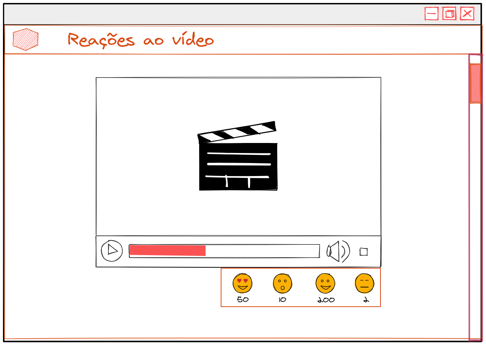
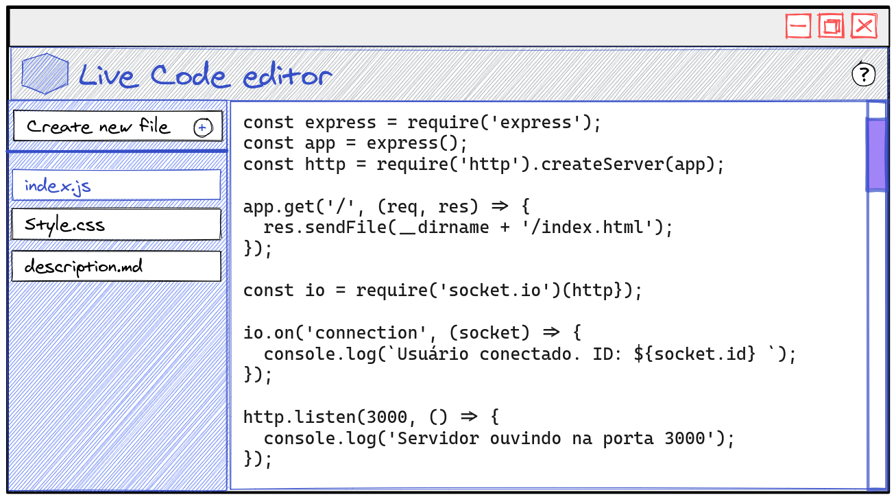

### Bloco 31, Dia 4 -> Sockets - Practicing Socket.io

> Atividade realizada em grupo.

Escolha uma das atividades abaixo e resolva-as de acordo com o que se pede.

 

_**Exercícios 31.4 - Atividade I - Leilão de centavos**_

Construa uma aplicação que permita com que uma pessoa consiga fazer lances para arrematar um produto. Considere que todos os produtos tem um valor de arremate de `100 reais`.

**Requisitos:**

 - Quando o valor de arremate chegar a R$ 100,00 o botão de dar um lance deve ser desabilitado e deve aparecer uma mensagem que o produto foi arrematado;

 - Cada vez que uma pessoa usuária clicar no botão para dar um lance, incremente o valor do lance atual em 5 reais e exiba na tela o valor atualizado;

**Bônus:**

 - Permitir que a pessoa usuária escolha seu nome;

 - Mostrar o nome de quem arrematou o item;

 

_**Exercícios 31.4 - Atividade II - Saia do seu Quadrado**_

Faça uma aplicação que tenha um quadrado sendo renderizado, e que a partir de cliques sobre este quadrado, ele mova-se tanto na sua tela, como na tela de outras pessoas que também estiverem online.

**Requisitos:**

 - Crie um botão para iniciar o jogo, na qual através do seu clique o quadrado apareça na tela;

 - Após iniciar o jogo, cada clique no quadrado deve fazer com que o próprio quadrado mova-se de maneira aleatória na página;

 - Deve haver um botão de reiniciar o jogo, na qual o quadrado deve voltar para a posição inicial de quando o jogo foi iniciado;

 - Caso o jogo tenha sido iniciado em páginas diferentes, o clique no quadrado deve afetar a página da outra pessoa online, ou seja, se o quadrado for para baixo na sua página, ele deverá ir para baixo na página das outras pessoas onlines também e vice-versa;

**Bônus:**

 - Tenha duas aplicações, uma em React e outra em Vanilla JS (igual mostrado no conteúdo do dia anterior);

 - Implemente novas funcionalidades na aplicação;

 

_**Exercícios 31.4 - Atividade III - Jogo da Velha**_

Faça uma aplicação que simula um jogo da velha onde duas pessoas podem jogar simultaneamente.

**Requisitos:**

 - Impeça que uma pessoa consiga realizar duas jogadas na sequência;

 - Quando alguma das pessoas vencer a partida, exiba para ambas quem venceu a partida;

 - Dê a possibilidade de quem entrar, poder escolher qual o símbolo irá usar;

 - Permita que a primeira pessoa a entrar na sala, seja a primeira pessoa a poder fazer a marcação no jogo;

**Bônus:**

 - Crie uma sala privada, impeça que outras pessoas entrem no jogo;

 - Tenha duas aplicações, uma em React e outra em Vanilla JS (igual mostrado no conteúdo do dia anterior);

 - Implemente novas funcionalidades na aplicação;

 

_**Exercícios 31.4 - Atividade IV - Mural de depoimentos**_

Crie uma aplicação usando `Socket.io` que simule um mural de depoimentos para uma pessoa onde novos depoimentos podem ser escritos e recebidos via `socket` por outros clientes conectados na mesma página.

**Requisitos:**

 - Deve haver um formulário para envio de novos depoimentos;

 - Um depoimento é composto pelo nome da pessoa autora e pela mensagem;

 - Deve haver a lista de todos os depoimentos com suas respectivas mensagens e pessoas autoras;

 - A atualização deve ser real time. Isto é, quando um novo depoimento for recebido, todos os clientes conectados devem receber o novo depoimento;

**Bônus:**

 - Os depoimentos devem ser persistidos em um banco de dados;

 - Listar todos os depoimentos já cadastrados ao carregar a páginas;

 

_**Exercícios 31.4 - Atividade V - Reações ao vídeo**_

Crie uma aplicação usando `Socket.io` que exibe um vídeo qualquer e uma lista de reações abaixo (Como **Amei**, **Aplausos**, etc...) de modo que todas as pessoas conectadas ao vídeo devem receber as reações em tempo real.

**Requisitos:**

 - Deve haver um botão para cada reação;

 - Cada reação deve ter um contador ao lado;

 - Todos os clientes conectados devem receber o número de cada reação em tempo real;

**Bônus:**

 - As reações devem ser persistidas em um banco de dados;

 - Carregar todas as reações já enviados ao carregar a página;

 

_**Exercícios 31.4 - Atividade VI - Live Code Editor**_

Construa um editor de texto em tempo real, que permita você criar e editar arquivos. As edições e criações feitas devem ser propagadas para todas as pessoas usuárias que estiverem online no seu sistema.

**Requisitos:**

 - Somente uma pessoa pode editar o arquivo por vez;

 - Enquanto alguém estiver editando um arquivo, os demais não devem conseguir editar esse mesmo arquivo;

 - As atualizações devem ser enviadas para todo mundo que estiver online;

 - Quando você acessar o sistema deve ser carregado os arquivos já existentes com seus respectivos conteúdos;

 - O nome dos novos arquivos devem ser criados de forma aleatória no backend;

 - Quando criar um arquivo ele deve aparecer para todo mundo que estiver online;

**Bônus:**

 - Deve haver um botão que habilite/desabilite o modo edição de um arquivo;

 - A pessoa usuária escolha o nome do arquivo na hora da criação;

 - Salvar as informações dos arquivos em um banco de dados ou em um arquivo `JSON`;
