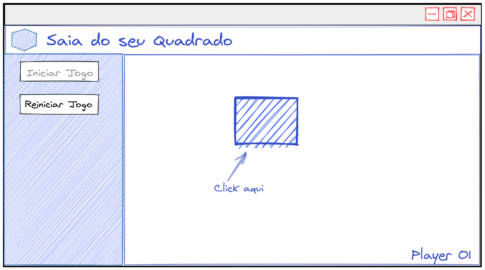

_**Exercícios 31.4 - Atividade II - Saia do seu Quadrado**_

Faça uma aplicação que tenha um quadrado sendo renderizado, e que a partir de cliques sobre este quadrado, ele mova-se tanto na sua tela, como na tela de outras pessoas que também estiverem online.

**Requisitos:**

 - Crie um botão para iniciar o jogo, na qual através do seu clique o quadrado apareça na tela;

 - Após iniciar o jogo, cada clique no quadrado deve fazer com que o próprio quadrado mova-se de maneira aleatória na página;

 - Deve haver um botão de reiniciar o jogo, na qual o quadrado deve voltar para a posição inicial de quando o jogo foi iniciado;

 - Caso o jogo tenha sido iniciado em páginas diferentes, o clique no quadrado deve afetar a página da outra pessoa online, ou seja, se o quadrado for para baixo na sua página, ele deverá ir para baixo na página das outras pessoas onlines também e vice-versa;

**Bônus:**

 - Tenha duas aplicações, uma em React e outra em Vanilla JS (igual mostrado no conteúdo do dia anterior);

 - Implemente novas funcionalidades na aplicação;
