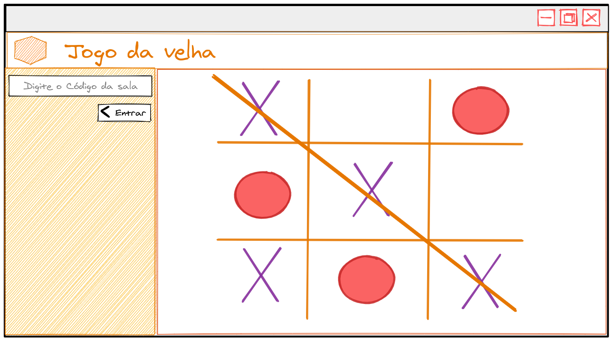

_**Exercícios 31.4 - Atividade III - Jogo da Velha**_

Faça uma aplicação que simula um jogo da velha onde duas pessoas podem jogar simultaneamente.

**Requisitos:**

 - Impeça que uma pessoa consiga realizar duas jogadas na sequência;

 - Quando alguma das pessoas vencer a partida, exiba para ambas quem venceu a partida;

 - Dê a possibilidade de quem entrar, poder escolher qual o símbolo irá usar;

 - Permita que a primeira pessoa a entrar na sala, seja a primeira pessoa a poder fazer a marcação no jogo;

**Bônus:**

 - Crie uma sala privada, impeça que outras pessoas entrem no jogo;

 - Tenha duas aplicações, uma em React e outra em Vanilla JS (igual mostrado no conteúdo do dia anterior);

 - Implemente novas funcionalidades na aplicação;
