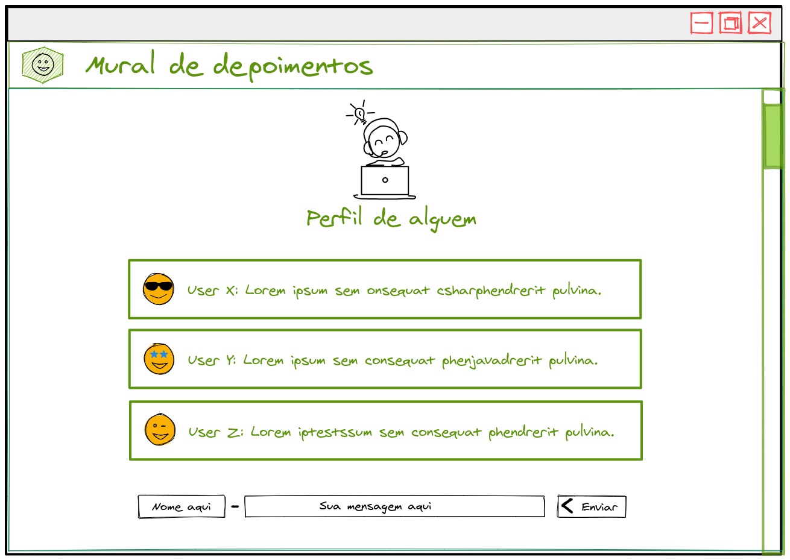

_**Exercícios 31.4 - Atividade IV - Mural de depoimentos**_

Crie uma aplicação usando `Socket.io` que simule um mural de depoimentos para uma pessoa onde novos depoimentos podem ser escritos e recebidos via `socket` por outros clientes conectados na mesma página.

**Requisitos:**

 - Deve haver um formulário para envio de novos depoimentos;

 - Um depoimento é composto pelo nome da pessoa autora e pela mensagem;

 - Deve haver a lista de todos os depoimentos com suas respectivas mensagens e pessoas autoras;

 - A atualização deve ser real time. Isto é, quando um novo depoimento for recebido, todos os clientes conectados devem receber o novo depoimento;

**Bônus:**

 - Os depoimentos devem ser persistidos em um banco de dados;

 - Listar todos os depoimentos já cadastrados ao carregar a páginas;
