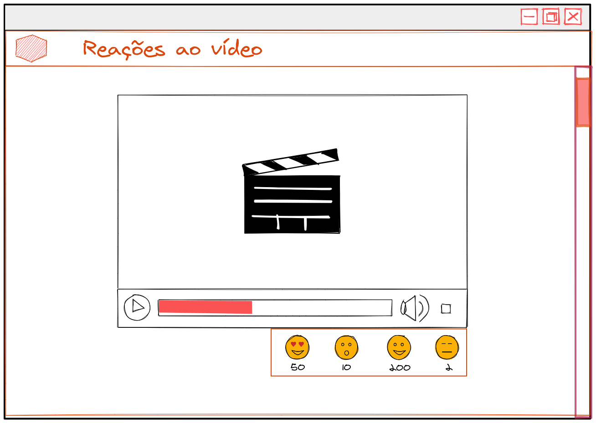

_**Exercícios 31.4 - Atividade V - Reações ao vídeo**_

Crie uma aplicação usando `Socket.io` que exibe um vídeo qualquer e uma lista de reações abaixo (Como **Amei**, **Aplausos**, etc...) de modo que todas as pessoas conectadas ao vídeo devem receber as reações em tempo real.

**Requisitos:**

 - Deve haver um botão para cada reação;

 - Cada reação deve ter um contador ao lado;

 - Todos os clientes conectados devem receber o número de cada reação em tempo real;

**Bônus:**

 - As reações devem ser persistidas em um banco de dados;

 - Carregar todas as reações já enviados ao carregar a página;