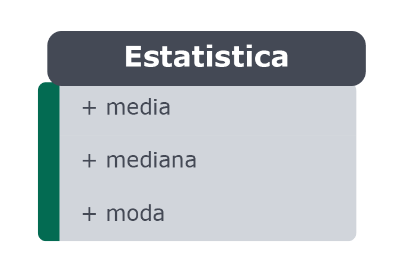

### Bloco 34, Dia 2 -> Herança, Composição e Interfaces

Vamos exercitar nossa capacidade de abstração em diferentes cenários. Em cada exercício reflita sobre a modelagem, as características, o comportamento e relações entre as classes e as implemente em **Python**!

_**Exercícios 34.2 - Parte I**_

Lembra do exercício da TV que já abstraímos? Hoje vamos implementar ele, porém com algumas modificações. Veja o diagrama abaixo:

 

 - Atributos:
   - `volume`: Será inicializado com um valor de `50` e só pode estar entre `0` e `99`;
   - `canal`: Será inicializado com um valor de `1` e só pode estar entre `1` e `99`;
   - `tamanho`: Será inicializado com o valor do parâmetro;
   - `ligada`: Será inicializado com o valor de `False`, pois está inicialmente desligado;
  
 > Todos os atributos devem ser privados.

 - Métodos:
   - `aumentar_volume`: Aumenta o volume de `1` em `1` até o máximo de `99`;
   - `diminuir_volume`: Diminui o volume de `1` em `1` até o mínimo de `0`;
   - `modificar_canal`: Altera o canal de acordo com o parâmetro recebido e deve lançar uma exceção (`ValueError`) caso o valor esteja fora dos limites;
   - `ligar_desligar`: Alterna o estado da TV entre ligado e desligado (`True` / `False`);

 

_**Exercícios 34.2 - Parte II**_

Defina uma classe `Estatistica` que calcule **média**, **mediana** e **moda** de uma lista de números.

_Dica: Utilize **métodos de classe**._

 

 

_**Exercícios 34.2 - Parte III**_

Que tal agora relembrarmos o exercício das figuras geométricas? Implemente o diagrama de classes abaixo.

 

 

_**Exercícios 34.2 - Parte IV**_

Implemente um sistemas de logs por nível de **severidade**, seguindo o diagrama abaixo:

 

**Classe Log**
 - Atributos:
   - `manipuladores`: Será inicializado com um conjunto de _subclasses_ de `ManipuladorDeLog`;
   - `canal`: Será inicializado com um valor de `1` e só pode estar entre `1` e `99`;
   - `tamanho`: Será inicializado com o valor do parâmetro;
   - `ligada`: Será inicializado com o valor de `False`, pois está inicialmente desligado;
  
 > Todos os atributos devem ser privados.

 - Métodos:
   - `adicionar_manipulador`: Adiciona um manipulador ao conjunto de manipuladores do gerenciamento de logs (`Log`);
   - `info`: Dispara logs com nível de severidade `"INFO"`;
   - `alerta`: Dispara logs com nível de severidade `"ALERTA"`;
   - `erro`: Dispara logs com nível de severidade `"ERRO"`;
   - `debug`: Dispara logs com nível de severidade `"DEBUG"`;
   - `__log`: Dispara os logs formatados para todos os manipuladores (invocado para cada nível de severidade, para evitar duplicação de código);
   - `__formatar`: Dormata os logs de acordo com o padrão `"[ERRO - 01/01/2020 13:00:00]: ZeroDivisionError: division by zero"`;   

 - A interface de manipulação de logs deve utilizar métodos de classe.  
 _Dica: Você pode utilizar a função print em tela ou em arquivo (que pode ter um nome padrão)._

 

_**Exercícios 34.2 - Parte V**_

Implemente um gerenciador de **quartos de hotel**, simplificado, conforme o diagrama a seguir:

 

**Classe Quarto**
 - Atributos:
   - `numero`: Número do quarto;
   - `andar`: Andar do quarto;
   - `quantidade_de_hospedes`: Capacidade de hospedagem do quarto;
   - `preco`: Valor da hospedagem;
   - `reservado`: Sempre inicializado com `False`, indica o estado do quarto;
  
**Classe Hospede**
 - Atributos:
   - `nome`: Nome do hospede;
   - `cpf`: CPF do hospede (para fins de simplificação, não é necessário validar o CPF);

**Classe Reserva**
 - Atributos:
   - `quarto`: É composto por uma instância de quarto;
   - `hospede`: É composto por uma instância de hospede;

**Classe Hotel**
 - Atributos:
   - `nome`: Nome do hotel;
   - `quartos`: É composto por uma lista de instâncias de quarto;
   - `reservas`: É composto por uma lista de instâncias de reserva;

 - Métodos:
   - `check_in`: Eecebe uma quantidade indefinida de hospedes e busca por um quarto disponível com capacidade suficiente. Se houver um quarto disponível, altera o estado do quarto e cria uma reserva para cada hospede. Caso não haja quartos disponíveis deve lançar a exceção `IndexError` com a mensagem `"Não há quartos disponíveis para essa quantidade de hospedes"`;
   - `check_out`: Eecebe uma instância de quarto, alterando seu estado e removendo todas as suas reservas;
   - `quartos_disponiveis`: Retorna uma lista de quartos disponíveis que comportam uma quantidade_de_hospedes (passado por parâmetro), priorizada da menor capacidade de hospedes possível para a maior. Lembre-se, para que um quarto esteja disponível, além de respeitar a capacidade, ele não pode estar reservado;

 

 **Observação**: Considere todos os atributos como sendo **públicos** para fins de simplificação da implementação.

 
