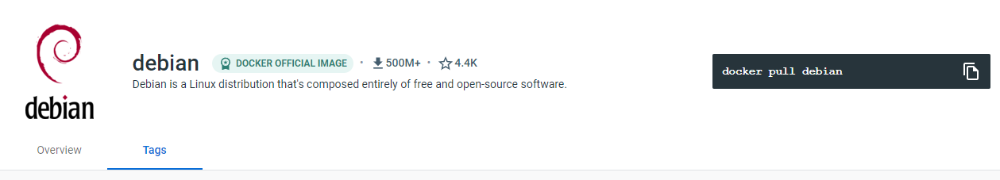
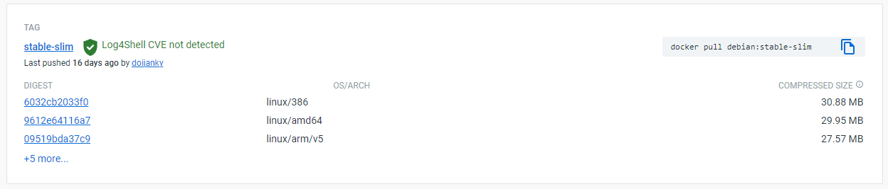

## Resolucao dos exercicios propostos no README.md

> 1. No [Docker Hub](https://hub.docker.com/search?q=&type=image), utilizando a caixa de busca `("Search for great content")`, busque pela **`imagem`** da **_Distribuição Linux Debian_**;



<br>

> 2. Uma vez que encontrar a **_imagem oficial_**, acesse-a (clicando em seu card) e verifique na página de detalhes. Confira se existe algum comando para baixar a imagem localmente sem ter que criar um `container` para isso;



<br>

> 3. Baixe a **`imagem`** utilizando a _tag_: `stable-slim`, que é uma versão reduzida da distribuição; 

```powershell
docker pull debian:stable-slim
```

<br>

> 4. Após baixar a **`imagem`** para seu computador local, **crie** e **execute** um `container` no modo interativo utilizando essa **`imagem`** como referência — não esqueça referenciar a `tag`;

```powershell
docker container run -it debian:stable-slim

# output:
root@4b662161955e:/# 
```

<br>

> 5. No terminal, você deve conseguir rodar o comando `cat /etc/*-release`, que vai retornar os dados da distribuição **Debian** que está sendo rodada dentro do `container`;

```powershell
cat /etc/*-release

# output:
PRETTY_NAME="Debian GNU/Linux 11 (bullseye)"
NAME="Debian GNU/Linux"
VERSION_ID="11"                                                                                                      VERSION="11 (bullseye)"
VERSION_CODENAME=bullseye
ID=debian
HOME_URL="https://www.debian.org/"
SUPPORT_URL="https://www.debian.org/support"
BUG_REPORT_URL="https://bugs.debian.org/"  
```

<br>

> 6. Encerre o terminal;

```powershell
exit
```

<br>

> 7. Verifique na sua **lista de contêiners** qual `container` se refere ao exercício que acabou de praticar;

```powershell
docker ps -l

# output:
CONTAINER ID   IMAGE                COMMAND   CREATED             STATUS                         PORTS     NAMES
549f1f472025   debian:stable-slim   "bash"    14 seconds ago      Exited (0) 2 seconds ago                 zen_hamilton  
```

<br>

> 8. Inicie o mesmo `container` novamente, sem criar outro. Valide se ele está ativo na **lista de contêiners**;

```powershell
docker start 549f

# output:
549f

docker container ls -a

# output:
CONTAINER ID   IMAGE                COMMAND   CREATED             STATUS                         PORTS     NAMES
549f1f472025   debian:stable-slim   "bash"    4 minutes ago       Up 12 seconds                            zen_hamilton  
```

<br>

> 9. Retome o `container` que foi criado anteriormente neste exercício;

```powershell
docker attach 549f

# output:
root@549f1f472025:/#
```

<br>

> 10. Rode o comando `cat /etc/debian_version` que deve retornar a versão atual do sistema do `container`;

```powershell
cat /etc/debian_version

# output:
11.5
```

<br>

> 11. Encerre o terminal;

```powershell
exit
```

<br>

> 12. Remova somente o `container` criado para esse exercício;

```powershell
docker container rm 549f

# output:
549f

docker container ls -a

#output:
CONTAINER ID   IMAGE     COMMAND   CREATED   STATUS    PORTS     NAMES
```

<br>

> 13. **[BÔNUS]** Crie e rode de modo interativo em modo `‘Cleanup’`, a `imagem` `andrius/ascii-patrol`;

```powershell
docker run -it --rm andrius/ascii-patrol

# output:
```


<br>

> 14. **[BÔNUS]** - Encerre o `container` utilizando os botões `ctrl + c`;

```
ctrl + c
```
