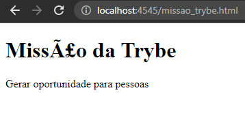
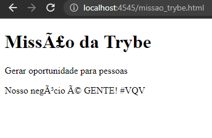
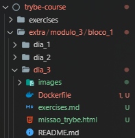
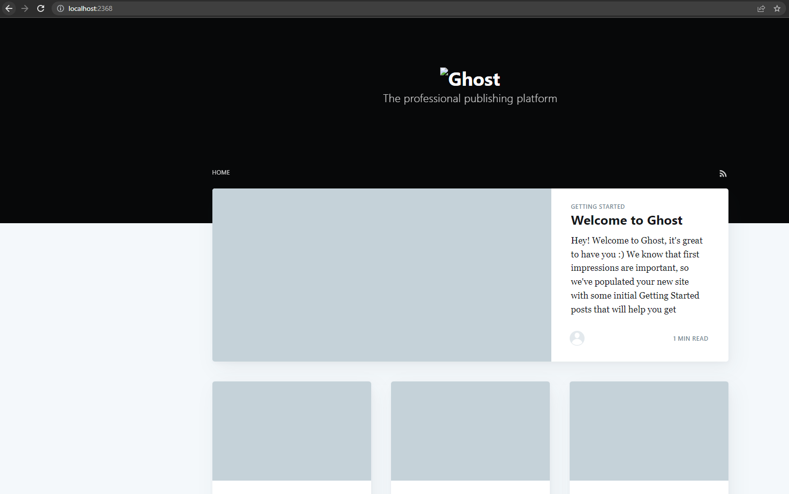

## Resolucao dos exercicios propostos no README.md

### _**Exercícios 01.3 - Parte I**_

> 1. Crie um arquivo `HTML` chamado `missao_trybe.html`;

```html
<!DOCTYPE html>
   <html>
      <head>
      <title>Trybe</title>
   </head>
   <body>
      <h1>Missão da Trybe</h1>
      <p>Gerar oportunidade para pessoas</p>
   </body>
</html>
```

<br>

> 2. Crie um container para manter um servidor `httpd:2.4` **Apache** e vincule sua porta interna com a porta `4545` da sua máquina local;

```powershell
# based on WSL2 directory
docker run -d --name site-trybe -p 4545:80 -v /home/gal/workspaces/trybe-course/extra/modulo_3/bloco_1/dia_3:/usr/local/apache2/htdocs httpd:2.4 

# output:
ec307e4d179249692b80dfdbe852c6966b65a3b71bc31ea7a49f0252bfbc6f16

# check if container is listed:
docker ps -a

# output:
CONTAINER ID   IMAGE       COMMAND                  CREATED              STATUS                   PORTS                  NAMES
ec307e4d1792   httpd:2.4   "httpd-foreground"       About a minute ago   Up About a minute        0.0.0.0:4545->80/tcp   site-trybe
```

<br>

> 3. Após criar o container acesse a página `HTML` que está rodando no servidor em seu browser;

```
http://localhost:4545/missao_trybe.html
```



<br>

> 4. Acesse o arquivo `missao_trybe.html` e acrescente a tag `<p>` com o seguinte texto `“Nosso negócio é GENTE! #VQV”`;

```html
<!DOCTYPE html>
   <html>
      <head>
      <title>Trybe</title>
   </head>
   <body>
      <h1>Missão da Trybe</h1>
      <p>Gerar oportunidade para pessoas</p>
      <p>Nosso negócio é GENTE! #VQV</p>
   </body>
</html>
```



<br>

> 5. Obtenha o `id` do `container` `httpd:2.4`;

```powershell
docker ps

# output:
CONTAINER ID   IMAGE       COMMAND              CREATED         STATUS         PORTS                  NAMES
ec307e4d1792   httpd:2.4   "httpd-foreground"   7 minutes ago   Up 7 minutes   0.0.0.0:4545->80/tcp   site-trybe
```

<br>

> 6. Obtenha o `Mounts` através da propriedade `Source` que deve mostrar o volume desse `container` no `Docker Host`;

```powershell
docker inspect ec307e4d1792

# output:
[
    {
    <# "Id": "ec307e4d179249692b80dfdbe852c6966b65a3b71bc31ea7a49f0252bfbc6f16",
        "Created": "2022-09-29T22:55:37.230538183Z",
        "Path": "httpd-foreground",
        "Args": [],
        "State": {
           ...
        },
        ...
        "HostConfig": {
            ...
        },
        "GraphDriver": {
            ...
        }, #>
        "Mounts": [
            {
                "Type": "bind",
                "Source": "/home/gal/workspaces/trybe-course/extra/modulo_3/bloco_1/dia_3",
                "Destination": "/usr/local/apache2/htdocs",
                "Mode": "",
                "RW": true,
                "Propagation": "rprivate"
            }
        ],
    <# "Config": {
            ...
        },
        "NetworkSettings": {
            ...
        } #>
    }
]
```

<br>

> 7. Agora **pare** o `container` `httpd:2.4`;

```powershell
docker stop ec307e4d1792

# output:
ec307e4d1792


# check if container has stopped:
docker ps -a

# output:
CONTAINER ID   IMAGE       COMMAND                  CREATED          STATUS                     PORTS     NAMES
ec307e4d1792   httpd:2.4   "httpd-foreground"       21 minutes ago   Exited (0) 2 minutes ago             site-trybe
```

<br>

> 8. **Exclua** o seu `container`;

```powershell
docker rm ec307e4d1792

# output:
ec307e4d1792


# check if container has been deleted:
docker ps -a

# output:
CONTAINER ID   IMAGE     COMMAND   CREATED   STATUS    PORTS     NAMES
```

<br>

> 9. Verifique se a **pasta** onde você salvou o arquivo `html` permanece no mesmo lugar;



> 10. Obtenha o `IMAGE ID` do **servidor**;

```powershell
docker images

# output:
REPOSITORY   TAG       IMAGE ID       CREATED       SIZE
httpd        2.4       f2789344c573   2 weeks ago   145MB
cowsay       latest    ea948024388d   4 years ago   228MB
```

<br>

> 11. Depois de obter o `IMAGE ID`, **exclua** a `imagem`;

```powershell
docker rmi -f f2789344c57

# output:
Untagged: httpd:2.4
Untagged: httpd@sha256:71e882df50adc606c57e46e5deb3c933288e2c7775472a639326d9e4e40a47c2
Deleted: sha256:f2789344c57324805883b174676365eb807fdb4eccfb9878fbb19054fd0c7b7e
Deleted: sha256:8645420909f2571f88a8775bd77896e324087a207297bccdd4eca350076402dc
Deleted: sha256:34316e53082728c849bbfaaefd0f66c19595fe575584806e6c1db7930ccf2a09
Deleted: sha256:efb04ac799d1b34e2fe721ac209fab087bc88f058467f363c3af79add4319af6
Deleted: sha256:a2bb3b1fd4835e5610a1606c07cc3697eaf9f4a8686cd9f5dc9389d82bcc497d
Deleted: sha256:b45078e74ec97c5e600f6d5de8ce6254094fb3cb4dc5e1cc8335fb31664af66e


# check if image has been deleted:
docker images

# output:
REPOSITORY   TAG       IMAGE ID       CREATED       SIZE
cowsay       latest    ea948024388d   4 years ago   228MB
```

<br><br>

### _**Exercícios 01.3 - Parte II**_

> 1. Crie o arquivo `Compose` seguindo os passos abaixo:
>    - Utilize a versão `“3”` no arquivo;
>    - Crie um `service` para subir a plataforma, utilize a `imagem` `ghost:1-alpine`;
>    - Publique a porta `2368`, fazendo `bind` também para a `2368`;

```yaml
# docker-compose.yaml
version: '3'

services:
  ghost:
    image: ghost:1-alpine
    ports:
      - 2368:2368
```

<br>

> 2. Suba a aplicação utilizando o `docker-compose` e então acesse a porta publicada para validar se deu tudo certo;

```powershell
docker compose up

# output:
[+] Running 10/10
 ⠿ ghost Pulled                                                                                                                                                                                                                                                         38.5s
   ⠿ aad63a933944 Pull complete                                                                                                                                                                                                                                          2.1s
   ⠿ 976f06839970 Pull complete                                                                                                                                                                                                                                          4.6s
   ⠿ c29b7930f4f9 Pull complete                                                                                                                                                                                                                                          4.9s
   ⠿ 18316e90c190 Pull complete                                                                                                                                                                                                                                          5.0s
   ⠿ 7aba797547c3 Pull complete                                                                                                                                                                                                                                          5.2s
   ⠿ ef529ab4d1ec Pull complete                                                                                                                                                                                                                                          5.4s
   ⠿ 96e7ecd230d9 Pull complete                                                                                                                                                                                                                                          7.6s
   ⠿ 59586d3e4b30 Pull complete                                                                                                                                                                                                                                         13.8s
   ⠿ 089ba083e7d4 Pull complete                                                                                                                                                                                                                                         13.8s
[+] Running 2/2
 ⠿ Network dia_3_default    Created                                                                                                                                                                                                                                      0.0s
 ⠿ Container dia_3-ghost-1  Created                                                                                                                                                                                                                                     51.0s
Attaching to dia_3-ghost-1
dia_3-ghost-1  | [2022-09-29 23:35:08] INFO Creating table: posts
dia_3-ghost-1  | [2022-09-29 23:35:08] INFO Creating table: users
dia_3-ghost-1  | [2022-09-29 23:35:08] INFO Creating table: posts_authors
dia_3-ghost-1  | [2022-09-29 23:35:08] INFO Creating table: roles
dia_3-ghost-1  | [2022-09-29 23:35:08] INFO Creating table: roles_users
dia_3-ghost-1  | [2022-09-29 23:35:08] INFO Creating table: permissions
dia_3-ghost-1  | [2022-09-29 23:35:08] INFO Creating table: permissions_users
dia_3-ghost-1  | [2022-09-29 23:35:08] INFO Creating table: permissions_roles
dia_3-ghost-1  | [2022-09-29 23:35:08] INFO Creating table: permissions_apps
dia_3-ghost-1  | [2022-09-29 23:35:08] INFO Creating table: settings
dia_3-ghost-1  | [2022-09-29 23:35:08] INFO Creating table: tags
dia_3-ghost-1  | [2022-09-29 23:35:09] INFO Creating table: posts_tags
dia_3-ghost-1  | [2022-09-29 23:35:09] INFO Creating table: apps
dia_3-ghost-1  | [2022-09-29 23:35:09] INFO Creating table: app_settings
dia_3-ghost-1  | [2022-09-29 23:35:09] INFO Creating table: app_fields
dia_3-ghost-1  | [2022-09-29 23:35:09] INFO Creating table: clients
dia_3-ghost-1  | [2022-09-29 23:35:09] INFO Creating table: client_trusted_domains
dia_3-ghost-1  | [2022-09-29 23:35:09] INFO Creating table: accesstokens
dia_3-ghost-1  | [2022-09-29 23:35:09] INFO Creating table: refreshtokens
dia_3-ghost-1  | [2022-09-29 23:35:09] INFO Creating table: subscribers
dia_3-ghost-1  | [2022-09-29 23:35:09] INFO Creating table: invites
dia_3-ghost-1  | [2022-09-29 23:35:09] INFO Creating table: brute
dia_3-ghost-1  | [2022-09-29 23:35:09] INFO Creating table: webhooks
dia_3-ghost-1  | [2022-09-29 23:35:09] INFO Model: Tag
dia_3-ghost-1  | [2022-09-29 23:35:09] INFO Model: Client
dia_3-ghost-1  | [2022-09-29 23:35:09] INFO Model: Role
dia_3-ghost-1  | [2022-09-29 23:35:09] INFO Model: Permission
dia_3-ghost-1  | [2022-09-29 23:35:09] INFO Model: User
dia_3-ghost-1  | [2022-09-29 23:35:10] INFO Model: Post
dia_3-ghost-1  | [2022-09-29 23:35:10] INFO Relation: Role to Permission
dia_3-ghost-1  | [2022-09-29 23:35:10] INFO Relation: Post to Tag
dia_3-ghost-1  | [2022-09-29 23:35:10] INFO Relation: User to Role
dia_3-ghost-1  | [2022-09-29 23:35:11] INFO Finished database migration! 
dia_3-ghost-1  | [2022-09-29 23:35:13] WARN Theme's file locales/en.json not found.
dia_3-ghost-1  | [2022-09-29 23:35:13] INFO Ghost is running in production...
dia_3-ghost-1  | [2022-09-29 23:35:13] INFO Your blog is now available on http://localhost:2368/
dia_3-ghost-1  | [2022-09-29 23:35:13] INFO Ctrl+C to shut down
dia_3-ghost-1  | [2022-09-29 23:35:13] INFO Ghost boot 2.335s
```

```
http://localhost:2368/
```



<br><br>

### _**Exercícios 01.3 - Parte III**_

> 1. Crie um novo serviço para o nosso banco de dados, podemos utilizar um `mysql`, utilize a `imagem` `mysql:5.7`;

```yaml
# docker-compose.yaml
version: '3'

services:
  ghost:
    image: ghost:1-alpine
    ports:
      - 2368:2368

  db:
    # Caso utilize MacOS, descomente essa linha abaixo:
    # platform: linux/x86_64
    image: mysql:5.7
```

<br>

> 2. Precisamos definir uma senha `root` para o nosso _bd_, para isso utilize a variável `MYSQL_ROOT_PASSWORD`, lembre-se que é possível utilizar a sintaxe `${}` para passar uma _env_ do `host`, para a _env_ do `container`;

```yaml
# docker-compose.yaml
version: '3'

services:
  ghost:
    image: ghost:1-alpine
    ports:
      - 2368:2368

  db:
    # Caso utilize MacOS, descomente essa linha abaixo:
    # platform: linux/x86_64
    image: mysql:5.7
    environment:
      MYSQL_ROOT_PASSWORD: password
```

<br>

> 3. Agora precisamos configurar nosso `service` com o `ghost` para utilizar o `MySQL`, para isso defina a variável `database__client` para `mysql`;

```yaml
# docker-compose.yaml
version: '3'

services:
  ghost:
    image: ghost:1-alpine
    restart: always
    ports:
      - 2368:2368
    depends_on:
      - "db"
    environment:
      # see https://ghost.org/docs/config/
      database__client: mysql

  db:
    # Caso utilize MacOS, descomente essa linha abaixo:
    # platform: linux/x86_64
    image: mysql:5.7
    environment:
      MYSQL_ROOT_PASSWORD: password
```

<br>

> 4. Defina o nome `ghost` para o nome do _database_ utilizando a variável `database__connection__database`;

```yaml
# docker-compose.yaml
version: '3'

services:
  ghost:
    image: ghost:1-alpine
    restart: always
    ports:
      - 2368:2368
    depends_on:
      - "db"
    environment:
      # see https://ghost.org/docs/config/
      database__client: mysql
      database__connection__database: ghost

  db:
    # Caso utilize MacOS, descomente essa linha abaixo:
    # platform: linux/x86_64
    image: mysql:5.7
    environment:
      MYSQL_ROOT_PASSWORD: password
```

<br>

> 5. E então, indique a conexão para o nosso `MySQL` na _env_ `database__connection__host`;

```yaml
# docker-compose.yaml
version: '3'

services:
  ghost:
    image: ghost:1-alpine
    restart: always
    ports:
      - 2368:2368
    depends_on:
      - "db"
    environment:
      # see https://ghost.org/docs/config/
      database__client: mysql
      database__connection__database: ghost
      database__connection__host: db

  db:
    # Caso utilize MacOS, descomente essa linha abaixo:
    # platform: linux/x86_64
    image: mysql:5.7
    environment:
      MYSQL_ROOT_PASSWORD: password
```

<br>

> 6. Para definir a pessoa usuária (_`root`_) e senha (_a mesma que definimos no nosso `MySQL`_), utilize respectivamente as _envs_ `database__connection__user` e `database__connection__password`;

```yaml
# docker-compose.yaml
version: '3'

services:
  ghost:
    image: ghost:1-alpine
    ports:
      - 2368:2368
    environment:
      # see https://ghost.org/docs/config/
      database__client: mysql
      database__connection__database: ghost
      database__connection__host: db
      database__connection__user: root
      database__connection__password: password

  db:
    # Caso utilize MacOS, descomente essa linha abaixo:
    # platform: linux/x86_64
    image: mysql:5.7
    environment:
      MYSQL_ROOT_PASSWORD: password
```

<br>

> 7. Utilize a opção `depends_on` para criar **relações de dependências** entre os serviços;

```yaml
# docker-compose.yaml
version: '3'

services:
  ghost:
    image: ghost:1-alpine
    restart: always # To ensure db connection
    ports:
      - 2368:2368
    depends_on:
      - "db"
    environment:
      # see https://ghost.org/docs/config/
      database__client: mysql
      database__connection__database: ghost
      database__connection__host: db
      database__connection__user: root
      database__connection__password: password

  db:
    # Caso utilize MacOS, descomente essa linha abaixo:
    # platform: linux/x86_64
    image: mysql:5.7
    environment:
      MYSQL_ROOT_PASSWORD: password
```

<br>

> 8. Suba o ambiente com o novo arquivo usando o `docker-compose` e então **acesse a porta**;

```powershell
# run 'docker start CONTAINER_ID' if container is not running
docker compose up

# output:
# [...]
dia_3-ghost-1  | [2022-10-03 14:49:00] INFO Ghost is running in production...
dia_3-ghost-1  | [2022-10-03 14:49:00] INFO Your blog is now available on http://localhost:2368/
dia_3-ghost-1  | [2022-10-03 14:49:00] INFO Ctrl+C to shut down
dia_3-ghost-1  | [2022-10-03 14:49:00] INFO Ghost boot 1.486s
```

<br><br>

### _**Exercícios 01.3 - Parte IV**_

> 1. Configure o nosso serviço `mysql` para utilizar um **volume**, conforme vimos no conteúdo, utilize o caminho _target_ `/var/lib/mysql`;

```yaml
# docker-compose.yaml
version: '3'

services:
  ghost:
    image: ghost:1-alpine
    restart: always # To ensure db connection
    ports:
      - 2368:2368
    depends_on:
      - "db"
    environment:
      # see https://ghost.org/docs/config/
      database__client: mysql
      database__connection__database: ghost
      database__connection__host: db
      database__connection__user: root
      database__connection__password: password

  db:
    # Caso utilize MacOS, descomente essa linha abaixo:
    # platform: linux/x86_64
    image: mysql:5.7
    environment:
      MYSQL_ROOT_PASSWORD: password
    volumes:
          - db-data:/var/lib/mysql

  volumes:
      db-data:
```

<br>

> 2. Ao invés de utilizar a rede padrão criada pelo **Compose**, defina uma rede chamada `my-network` para a comunicação dos dois serviços;

```yaml
# docker-compose.yaml
version: '3'

services:
  ghost:
    image: ghost:1-alpine
    restart: always # To ensure db connection
    ports:
      - 2368:2368
    depends_on:
      - "db"
    environment:
      # see https://ghost.org/docs/config/
      database__client: mysql
      database__connection__database: ghost
      database__connection__host: db
      database__connection__user: root
      database__connection__password: password
    networks:
          - my-network

  db:
    # Caso utilize MacOS, descomente essa linha abaixo:
    # platform: linux/x86_64
    image: mysql:5.7
    restart: always # To ensure db connection
    environment:
      MYSQL_ROOT_PASSWORD: password
    volumes:
          - db-data:/var/lib/mysql
    networks:
          - my-network

  volumes:
      db-data:

  networks:
      my-network:
```